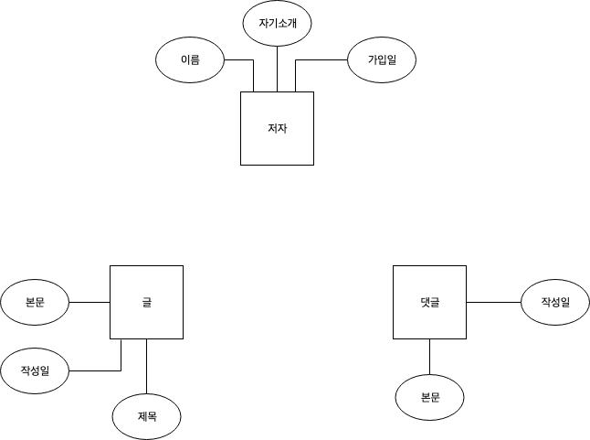
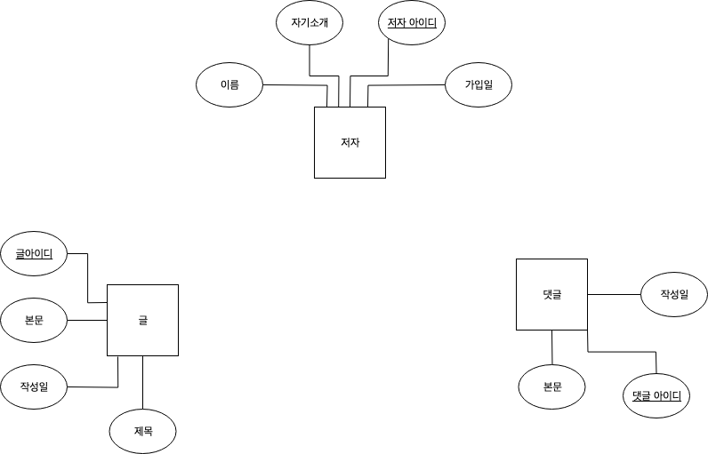
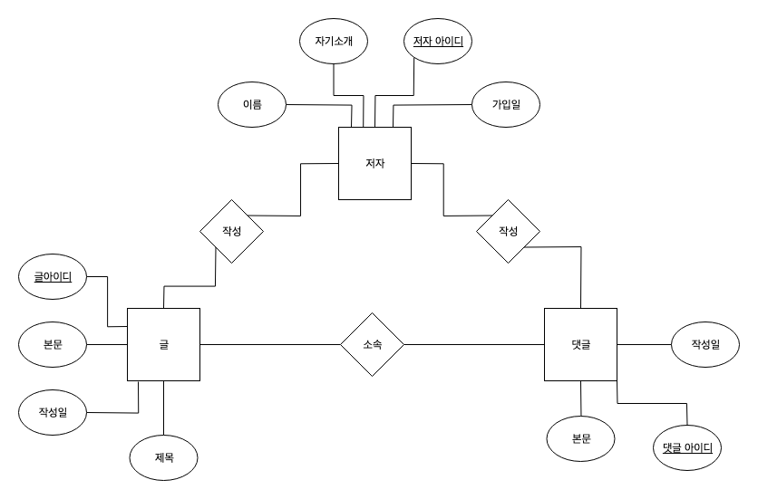
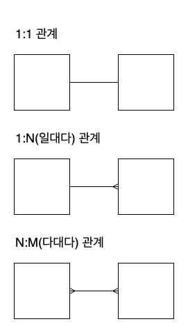
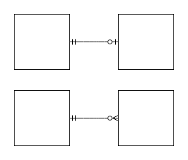
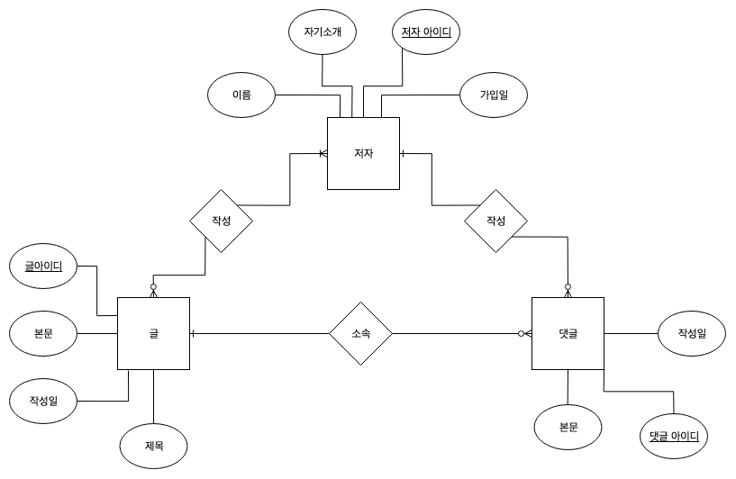
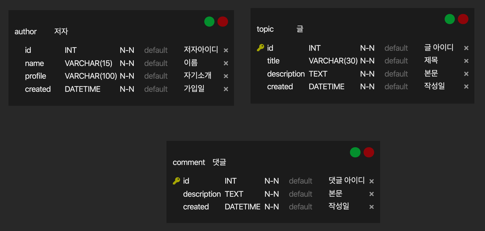

# learn-database

생활코딩에서 데이터베이스에 대해서 배운 내용을 정리하는 레포입니다.

## DATABASE1

- database : 데이터를 저장하고 출력하기 위한 전문적인 소프트웨어
- database 제품군 : MySQL, Oracle, SQL Server, PostgreSQL, Mongo DB 등등

### 데이터베이스의 본질

- input: Create, Update, Delete
- output: Read

### file vs database

- text file => spreadsheet(excel)
- Database는 컴퓨터 언어를 통해서 자동화할 수 있음.

### 수업을 마치며

- 회사에서 이미 정해놓은 데이터베이스가 있다면 그것을 사용해야함
- https://db-engines.com/en/ranking
- 데이터베이스 시장의 절대 강자는 관계형 데이터베이스
- 관계형 데이터베이스 중에 하나를 골라서 공부하고 그 다음에 관계형 데이터베이스가 아닌 것을 공부하는 것을 추천
- 관계형 데이터베이스는 1970년대부터 개발되어 데이터베이스의 강자로 존재하였음.
- IoT, SNS 등이 등장하면서 기존의 관계형 데이터베이스의 한계가 나타나게 되고 2010년에 관계형 데이터베이스가 아닌 것들이 등장하게 됨 (NoSQL)
- Oracle : 오래동안 절대 강자를 지킨 데이터베이스. 관공서, 큰 기업 (비용이 비싸고 기술지원도 비쌈), 금융 (신뢰성이 필요한 곳에서 주로 사용)
- MySQL : 무료고 오픈소스임. 개인 ,작은 기업, SNS에서 사용하기 적합 => 초심자에게 추천

## DATABASE2 - MySQL

- 1994년 스웨덴에서 개발되기 시작한 MySQL.
- 무료이고 오픈소스.
- MySQL은 WEB과 함께 폭발적으로 성장함

### 데이터베이스의 목적

- 관계형 데이터베이스는 스프레이드시트처럼 데이터를 표형태로 표현해줌
- 데이터베이스는 컴퓨터 언어를 통해서 제어할 수 있음

### MySQL 설치

각자의 운영체제에서 설치하기

- https://dev.mysql.com/downloads/mysql/

docker 이용하기

- https://hub.docker.com/_/mysql/
- https://hub.docker.com/_/mysql?tab=tags

```bash
# docekr mysql 5.7.29 이미지 설치
$ docker pull mysql:5.7.29

# mysql 이미지 실행
$ docker run -d -p 3306:3306 \
  -e MYSQL_ALLOW_EMPTY_PASSWORD=true \
  --name mysql \
  mysql:5.7.29
# 위의 예제는 비밀번호 없이 접속할 수 있도록 해준 것이고 비밀번호를 지정하고 싶으시면 MYSQL_ROOT_PASSWORD 의 옵션에 넣어주시면 됩니다.

# docker 컨테이너 아이디 확인
$ docker ps

# docker 컨테이너 접속
$ docker exec -it [컨테이너 아이디] /bin/bash

# 접속 후 mysql 접속
$ mysql
```

### MySQL의 구조

- 표(table) : 데이터를 기록하는 최종적인 곳
- 데이터베이스(database) : 표들을 그룹핑 한 것, 스키마(Schema) : 서로 연관된 데이터들를 그룹핑 해줌
- 데이터베이스 서버(database server)

### MySQL 서버 접속

- 데이터베이스는 파일에 비해 보안적인 면을 더 가지고 있음
- 권한 기능을 가지고 있음
- root는 모든 권한을 가지고 있음
- 권장사항으로는 root가 아닌 제한적인 유저로 접속하는 것

```bash
# root로 접속(비밀번호 입력)
$ mysql -uroot -p
```

### MySQL 스키마(schema)의 사용

"mysql create database"로 검색

https://dev.mysql.com/doc/refman/5.7/en/creating-database.html

```bash
# 데이터베이스 생성
$ CREATE DATABASE [데이터베이스 이름];
```

"mysql delete database"로 검색

https://dev.mysql.com/doc/refman/5.7/en/drop-database.html

```bash
# 데이터베이스 삭제
$ DROP DATABASE [데이터베이스 이름];
```

- 명령어를 외우는게 아니라 검색하는 방법이 나음
- 예) 데이터베이스 내용을 보고 싶을 때 "how to show database in mysql"로 검색

https://dev.mysql.com/doc/refman/5.7/en/show-databases.html

```bash
# 데이터베이스 조회
$ SHOW DATABASES;

# 데이터베이스 사용
$ USE [데이터베이스 이름];
```

### SQL과 테이블의 구조

- SQL(Structured Query Language) : 쉽고 중요함.(수많은 관계형 데이터베이스들의 표준화된 언어)
- table(표) : 행(row,record)와 열(column)으로 이루어져 있음.

### MySQL 테이블의 생성

https://devhints.io/mysql

여러 언어에는 cheatsheet가 존재함.

https://www.techonthenet.com/mysql/datatypes.php

```sql
$ CREATE TABLE topic (
  id INT(11) NOT NULL AUTO_INCREMENT,
  title VARCHAR(100) NOT NULL,
  description TEXT,
  created DATETIME NOT NULL,
  author VARCHAR(30),
  profile VARCHAR(100),
  PRIMARY KEY(id)
);
```

- AUTO_INCREMENT: 값이 1씩 자동으로 증가
- NOT NULL : 값이 없는것을 허용하지 않음
- NULL : 값이 없는 것을 허용함

- PRIMARY KEY => 성능, 중복 방지

### MySQL의 CRUD

- Create
- Read
- Update
- Delete

가장 핵심적인 기능은 Create, Read

### SQL의 INSERT 구문

테이블 구조 보기

```sql
$ DESC topic;
```

row 생성

```sql
$ INSERT INTO topic (title,description,created,author, profile) VALUES('MySQL','MySQL is ...',NOW(),'egoing','developer');
```

topic table에서 모든 데이터 조회

```sql
$ SELECT * FROM topic;
```

### SQL의 SELECT 구문

topic table에서 모든 행 조회

```sql
$ SELECT * FROM topic;

+----+------------+------------------+---------------------+--------+--------------------------+
| id | title      | description      | created             | author | profile                  |
+----+------------+------------------+---------------------+--------+--------------------------+
|  1 | MySQL      | MySQL is ...     | 2020-01-17 13:06:24 | egoing | developer                |
|  2 | ORACLE     | OCRACLE is...    | 2020-01-17 13:11:21 | egoing | developer                |
|  3 | SQL Server | SQL Server is... | 2020-01-17 13:12:42 | duru   | database administrator   |
|  4 | PostgreSQL | PostgreSQL is... | 2020-01-17 13:14:03 | taeho  | data scientist,developer |
|  5 | MongoDB    | MongoDB is...    | 2020-01-17 13:14:42 | egoing | developer                |
+----+------------+------------------+---------------------+--------+--------------------------+
```

topic table에서 id,title,created,author행 조회

```sql
$ SELECT id,title,created,author FROM topic;

+----+------------+---------------------+--------+
| id | title      | created             | author |
+----+------------+---------------------+--------+
|  1 | MySQL      | 2020-01-17 13:06:24 | egoing |
|  2 | ORACLE     | 2020-01-17 13:11:21 | egoing |
|  3 | SQL Server | 2020-01-17 13:12:42 | duru   |
|  4 | PostgreSQL | 2020-01-17 13:14:03 | taeho  |
|  5 | MongoDB    | 2020-01-17 13:14:42 | egoing |
+----+------------+---------------------+--------+
```

https://dev.mysql.com/doc/refman/5.7/en/select.html

topic table에서 id,title,created,author행에서 author가 egoing인 행을 조회

```sql
$ SELECT id,title,created,author FROM topic WHERE author='egoing';

+----+---------+---------------------+--------+
| id | title   | created             | author |
+----+---------+---------------------+--------+
|  1 | MySQL   | 2020-01-17 13:06:24 | egoing |
|  2 | ORACLE  | 2020-01-17 13:11:21 | egoing |
|  5 | MongoDB | 2020-01-17 13:14:42 | egoing |
+----+---------+---------------------+--------+
```

topic table에서 id,title,created,author행에서 author가 egoing인 행을 조회하고 id를 DESC로 정렬해서 조회

```sql
$ SELECT id,title,created,author FROM topic WHERE author='egoing' ORDER BY id DESC;

+----+---------+---------------------+--------+
| id | title   | created             | author |
+----+---------+---------------------+--------+
|  5 | MongoDB | 2020-01-17 13:14:42 | egoing |
|  2 | ORACLE  | 2020-01-17 13:11:21 | egoing |
|  1 | MySQL   | 2020-01-17 13:06:24 | egoing |
+----+---------+---------------------+--------+
```

topic table에서 id,title,created,author행에서 author가 egoing인 행을 조회하고 id를 DESC로 정렬하고 결과를 2개로 제한함

```sql
$ SELECT id,title,created,author FROM topic WHERE author='egoing' ORDER BY id DESC LIMIT 2;

+----+---------+---------------------+--------+
| id | title   | created             | author |
+----+---------+---------------------+--------+
|  5 | MongoDB | 2020-01-17 13:14:42 | egoing |
|  2 | ORACLE  | 2020-01-17 13:11:21 | egoing |
+----+---------+---------------------+--------+
```

### SQL의 UPDATE 구문

https://dev.mysql.com/doc/refman/5.7/en/update.html

```sql
$ DESC topic;

+-------------+--------------+------+-----+---------+----------------+
| Field       | Type         | Null | Key | Default | Extra          |
+-------------+--------------+------+-----+---------+----------------+
| id          | int(11)      | NO   | PRI | NULL    | auto_increment |
| title       | varchar(100) | NO   |     | NULL    |                |
| description | text         | YES  |     | NULL    |                |
| created     | datetime     | NO   |     | NULL    |                |
| author      | varchar(30)  | YES  |     | NULL    |                |
| profile     | varchar(100) | YES  |     | NULL    |                |
+-------------+--------------+------+-----+---------+----------------+
```

```sql
$ SELECT * FROM topic;

+----+------------+------------------+---------------------+--------+--------------------------+
| id | title      | description      | created             | author | profile                  |
+----+------------+------------------+---------------------+--------+--------------------------+
|  1 | MySQL      | MySQL is ...     | 2020-01-17 13:06:24 | egoing | developer                |
|  2 | ORACLE     | OCRACLE is...    | 2020-01-17 13:11:21 | egoing | developer                |
|  3 | SQL Server | SQL Server is... | 2020-01-17 13:12:42 | duru   | database administrator   |
|  4 | PostgreSQL | PostgreSQL is... | 2020-01-17 13:14:03 | taeho  | data scientist,developer |
|  5 | MongoDB    | MongoDB is...    | 2020-01-17 13:14:42 | egoing | developer                |
+----+------------+------------------+---------------------+--------+--------------------------+
```

```sql
$ UPDATE topic SET description='Oracle is...', title='Oracle' WHERE id=2;

$ SELECT * FROM topic;

+----+------------+------------------+---------------------+--------+--------------------------+
| id | title      | description      | created             | author | profile                  |
+----+------------+------------------+---------------------+--------+--------------------------+
|  1 | MySQL      | MySQL is ...     | 2020-01-17 13:06:24 | egoing | developer                |
|  2 | Oracle     | Oracle is...     | 2020-01-17 13:11:21 | egoing | developer                |
|  3 | SQL Server | SQL Server is... | 2020-01-17 13:12:42 | duru   | database administrator   |
|  4 | PostgreSQL | PostgreSQL is... | 2020-01-17 13:14:03 | taeho  | data scientist,developer |
|  5 | MongoDB    | MongoDB is...    | 2020-01-17 13:14:42 | egoing | developer                |
+----+------------+------------------+---------------------+--------+--------------------------+
```

UPDATE를 사용할 때 WHERE를 꼭 같이 사용해야함

### SQL의 DELETE 구문

https://dev.mysql.com/doc/refman/5.7/en/delete.html

DELETE를 사용할 때 WHERE를 꼭 같이 사용해야함

```sql
$ SELECT * FROM topic;

+----+------------+------------------+---------------------+--------+--------------------------+
| id | title      | description      | created             | author | profile                  |
+----+------------+------------------+---------------------+--------+--------------------------+
|  1 | MySQL      | MySQL is ...     | 2020-01-17 13:06:24 | egoing | developer                |
|  2 | Oracle     | Oracle is...     | 2020-01-17 13:11:21 | egoing | developer                |
|  3 | SQL Server | SQL Server is... | 2020-01-17 13:12:42 | duru   | database administrator   |
|  4 | PostgreSQL | PostgreSQL is... | 2020-01-17 13:14:03 | taeho  | data scientist,developer |
|  5 | MongoDB    | MongoDB is...    | 2020-01-17 13:14:42 | egoing | developer                |
+----+------------+------------------+---------------------+--------+--------------------------+
```

```sql
$ DELETE FROM topic WHERE id=5;

$ SELECT * FROM topic;

+----+------------+------------------+---------------------+--------+--------------------------+
| id | title      | description      | created             | author | profile                  |
+----+------------+------------------+---------------------+--------+--------------------------+
|  1 | MySQL      | MySQL is ...     | 2020-01-17 13:06:24 | egoing | developer                |
|  2 | Oracle     | Oracle is...     | 2020-01-17 13:11:21 | egoing | developer                |
|  3 | SQL Server | SQL Server is... | 2020-01-17 13:12:42 | duru   | database administrator   |
|  4 | PostgreSQL | PostgreSQL is... | 2020-01-17 13:14:03 | taeho  | data scientist,developer |
+----+------------+------------------+---------------------+--------+--------------------------+
```

### 수업의 정상

- 본질과 혁신을 분리
- Database(본질), Relational(혁신)

### 관계형 데이터베이스의 필요성

- 데이터가 중복된다는 것은 퍼포먼스와 유지보수의 측면에서 개선이 필요함
- Trade-off : 하나의 데이터베이스는 직관적으로 데이터를 볼 수 있지만, 관계형에선 새로운 데이터베이스를 참조하여 확인해야하는 불편함이 있음
- MySQL을 통해서, 중복을 피해 데이터를 저장하면서도 한 눈에 데이터를 볼 수 있게 됨

### 테이블 분리하기

topic 테이블 생성

```sql
$ CREATE TABLE `topic` (
  `id` int(11) NOT NULL AUTO_INCREMENT,
  `title` varchar(30) NOT NULL,
  `description` text,
  `created` datetime NOT NULL,
  `author_id` int(11) DEFAULT NULL,
  PRIMARY KEY (`id`)
);

$ DESC topic;

+-------------+-------------+------+-----+---------+----------------+
| Field       | Type        | Null | Key | Default | Extra          |
+-------------+-------------+------+-----+---------+----------------+
| id          | int(11)     | NO   | PRI | NULL    | auto_increment |
| title       | varchar(30) | NO   |     | NULL    |                |
| description | text        | YES  |     | NULL    |                |
| created     | datetime    | NO   |     | NULL    |                |
| author_id   | int(11)     | YES  |     | NULL    |                |
+-------------+-------------+------+-----+---------+----------------+
```

```sql
$ CREATE TABLE `author` (
  `id` int(11) NOT NULL AUTO_INCREMENT,
  `name` varchar(20) NOT NULL,
  `profile` varchar(200) DEFAULT NULL,
  PRIMARY KEY (`id`)
);

$ DESC author;

+---------+--------------+------+-----+---------+----------------+
| Field   | Type         | Null | Key | Default | Extra          |
+---------+--------------+------+-----+---------+----------------+
| id      | int(11)      | NO   | PRI | NULL    | auto_increment |
| name    | varchar(20)  | NO   |     | NULL    |                |
| profile | varchar(200) | YES  |     | NULL    |                |
+---------+--------------+------+-----+---------+----------------+
```

```sql
$ INSERT INTO `author` VALUES (1,'egoing','developer');
$ INSERT INTO `author` VALUES (2,'duru','database administrator');
$ INSERT INTO `author` VALUES (3,'taeho','data scientist, developer');

$ SELECT * FROM author;

+----+--------+---------------------------+
| id | name   | profile                   |
+----+--------+---------------------------+
|  1 | egoing | developer                 |
|  2 | duru   | database administrator    |
|  3 | taeho  | data scientist, developer |
+----+--------+---------------------------+
```

```sql
$ INSERT INTO `topic` VALUES (1,'MySQL','MySQL is...','2018-01-01 12:10:11',1);
$ INSERT INTO `topic` VALUES (2,'Oracle','Oracle is ...','2018-01-03 13:01:10',1);
$ INSERT INTO `topic` VALUES (3,'SQL Server','SQL Server is ...','2018-01-20 11:01:10',2);
$ INSERT INTO `topic` VALUES (4,'PostgreSQL','PostgreSQL is ...','2018-01-23 01:03:03',3);
$ INSERT INTO `topic` VALUES (5,'MongoDB','MongoDB is ...','2018-01-30 12:31:03',1);

$ SELECT * FROM topic;

+----+------------+-------------------+---------------------+-----------+
| id | title      | description       | created             | author_id |
+----+------------+-------------------+---------------------+-----------+
|  1 | MySQL      | MySQL is...       | 2018-01-01 12:10:11 |         1 |
|  2 | Oracle     | Oracle is ...     | 2018-01-03 13:01:10 |         1 |
|  3 | SQL Server | SQL Server is ... | 2018-01-20 11:01:10 |         2 |
|  4 | PostgreSQL | PostgreSQL is ... | 2018-01-23 01:03:03 |         3 |
|  5 | MongoDB    | MongoDB is ...    | 2018-01-30 12:31:03 |         1 |
+----+------------+-------------------+---------------------+-----------+
```

### 관계형 데이터베이스의 꽃 JOIN

```sql
$ SELECT * FROM topic;

+----+------------+-------------------+---------------------+-----------+
| id | title      | description       | created             | author_id |
+----+------------+-------------------+---------------------+-----------+
|  1 | MySQL      | MySQL is...       | 2018-01-01 12:10:11 |         1 |
|  2 | Oracle     | Oracle is ...     | 2018-01-03 13:01:10 |         1 |
|  3 | SQL Server | SQL Server is ... | 2018-01-20 11:01:10 |         2 |
|  4 | PostgreSQL | PostgreSQL is ... | 2018-01-23 01:03:03 |         3 |
|  5 | MongoDB    | MongoDB is ...    | 2018-01-30 12:31:03 |         1 |
+----+------------+-------------------+---------------------+-----------+
```

```sql
$ SELECT * FROM topic LEFT JOIN author ON topic.author_id = author.id;
+----+------------+-------------------+---------------------+-----------+------+--------+---------------------------+
| id | title      | description       | created             | author_id | id   | name   | profile                   |
+----+------------+-------------------+---------------------+-----------+------+--------+---------------------------+
|  1 | MySQL      | MySQL is...       | 2018-01-01 12:10:11 |         1 |    1 | egoing | developer                 |
|  2 | Oracle     | Oracle is ...     | 2018-01-03 13:01:10 |         1 |    1 | egoing | developer                 |
|  5 | MongoDB    | MongoDB is ...    | 2018-01-30 12:31:03 |         1 |    1 | egoing | developer                 |
|  3 | SQL Server | SQL Server is ... | 2018-01-20 11:01:10 |         2 |    2 | duru   | database administrator    |
|  4 | PostgreSQL | PostgreSQL is ... | 2018-01-23 01:03:03 |         3 |    3 | taeho  | data scientist, developer |
+----+------------+-------------------+---------------------+-----------+------+--------+---------------------------+
```

```sql
$ SELECT topic.id,title,description,created,name,profile FROM topic LEFT JOIN author ON topic.author_id = author.id;

+----+------------+-------------------+---------------------+--------+---------------------------+
| id | title      | description       | created             | name   | profile                   |
+----+------------+-------------------+---------------------+--------+---------------------------+
|  1 | MySQL      | MySQL is...       | 2018-01-01 12:10:11 | egoing | developer                 |
|  2 | Oracle     | Oracle is ...     | 2018-01-03 13:01:10 | egoing | developer                 |
|  5 | MongoDB    | MongoDB is ...    | 2018-01-30 12:31:03 | egoing | developer                 |
|  3 | SQL Server | SQL Server is ... | 2018-01-20 11:01:10 | duru   | database administrator    |
|  4 | PostgreSQL | PostgreSQL is ... | 2018-01-23 01:03:03 | taeho  | data scientist, developer |
+----+------------+-------------------+---------------------+--------+---------------------------+
```

```sql
$ SELECT topic.id AS topic_id,title,description,created,name,profile FROM topic LEFT JOIN author ON topic.author_id = author.id;

+----------+------------+-------------------+---------------------+--------+---------------------------+
| topic_id | title      | description       | created             | name   | profile                   |
+----------+------------+-------------------+---------------------+--------+---------------------------+
|        1 | MySQL      | MySQL is...       | 2018-01-01 12:10:11 | egoing | developer                 |
|        2 | Oracle     | Oracle is ...     | 2018-01-03 13:01:10 | egoing | developer                 |
|        5 | MongoDB    | MongoDB is ...    | 2018-01-30 12:31:03 | egoing | developer                 |
|        3 | SQL Server | SQL Server is ... | 2018-01-20 11:01:10 | duru   | database administrator    |
|        4 | PostgreSQL | PostgreSQL is ... | 2018-01-23 01:03:03 | taeho  | data scientist, developer |
+----------+------------+-------------------+---------------------+--------+---------------------------+
```

### 인터넷과 데이터베이스

**Internet**

- 각자 흩어져있는 컴퓨터들이 인터넷으로 연결되면서 컴퓨터들간의 사회가 형성됨
- 한대의 컴퓨터는 다른 컴퓨터에 요청하고 다른 한대의 컴퓨터는 요청에 응답함
- 정보를 요청하는 쪽과 응답하는 쪽이 나눠지게됨

- client(요청), server(응답)
- web => web client, web server
- game => game client, game server

- database client, database server
- MySQL monitor(cli), workbench(gui) => database client

목표는 이해가 아니라 익숙해지는 것

### MySQL 클라이언트

**MySQL monitor**

- 명령어 기반
- 장점 : 서버설치시 함께 설치됨.
- 단점 : 명령어를 기억해야함

https://www.quora.com/What-is-the-best-MySQL-client-for-Mac-OS-X-or-Windows

### MySQL Workbench

https://www.mysql.com/products/workbench/

https://dev.mysql.com/downloads/workbench/

### 수업을 마치며

- SQL
- index (색인)
- modeling
- backup (mysqldump, binary log, ...)
- cloud (AWS RDS, Google Cloud SQL for MySQL, AZURE Database for MySQL, ...)
- programming (python mysql api, PHP mysql api, Java mysql api, ...)

## SQL Join

### 표 쪼개기

https://docs.google.com/spreadsheets/d/1OUHAnTPdx0ga8P1_HBm6WUuWs02tvV-31mgi__XmRbc/edit?usp=sharing

- 중복이 보이면 표를 쪼갠다.
- 모든 표는 하나의 테마(주제)만 가져야함

### 실습준비

https://sql-joins.leopard.in.ua

- 그림에 더 집중

https://github.com/egoing/sql-join

```sql
DROP TABLE IF EXISTS `author`;
CREATE TABLE `author` (
  `aid` int(11) NOT NULL,
  `name` varchar(10) DEFAULT NULL,
  `city` varchar(10) DEFAULT NULL,
  `profile_id` int(11) DEFAULT NULL,
  PRIMARY KEY (`aid`)
) ENGINE=InnoDB DEFAULT CHARSET=utf8;
INSERT INTO `author` VALUES (1,'egoing','seoul',1),(2,'leezche','jeju',2),(3,'blackdew','namhae',3);

DROP TABLE IF EXISTS `profile`;
CREATE TABLE `profile` (
  `pid` int(11) NOT NULL,
  `title` varchar(10) DEFAULT NULL,
  `description` tinytext,
  PRIMARY KEY (`pid`)
) ENGINE=InnoDB DEFAULT CHARSET=utf8;
INSERT INTO `profile` VALUES (1,'developer','developer is ...'),(2,'designer','designer is ..'),(3,'DBA','DBA is ...');

DROP TABLE IF EXISTS `topic`;
CREATE TABLE `topic` (
  `tid` int(11) NOT NULL,
  `title` varchar(45) DEFAULT NULL,
  `description` tinytext,
  `author_id` varchar(45) DEFAULT NULL,
  PRIMARY KEY (`tid`)
) ENGINE=InnoDB DEFAULT CHARSET=utf8;
INSERT INTO `topic` VALUES (1,'HTML','HTML is ...','1'),(2,'CSS','CSS is ...','2'),(3,'JavaScript','JavaScript is ..','1'),(4,'Database','Database is ...',NULL);
```

#### LEFT JOIN

- LEFT JOIN : 기준이 되는 표를 왼쪽에 두고 이 표를 기준으로 오른쪽의 표를 합성해서 하나의 표를 만드는 방법

```sql
$ SELECT * FROM topic;
+-----+------------+------------------+-----------+
| tid | title      | description      | author_id |
+-----+------------+------------------+-----------+
|   1 | HTML       | HTML is ...      | 1         |
|   2 | CSS        | CSS is ...       | 2         |
|   3 | JavaScript | JavaScript is .. | 1         |
|   4 | Database   | Database is ...  | NULL      |
+-----+------------+------------------+-----------+
```

```sql
$ SELECT * FROM author;
+-----+----------+--------+------------+
| aid | name     | city   | profile_id |
+-----+----------+--------+------------+
|   1 | egoing   | seoul  |          1 |
|   2 | leezche  | jeju   |          2 |
|   3 | blackdew | namhae |          3 |
+-----+----------+--------+------------+
```

```sql
$ SELECT * FROM topic LEFT JOIN author ON topic.author_id = author.aid;
+-----+------------+------------------+-----------+------+---------+-------+------------+
| tid | title      | description      | author_id | aid  | name    | city  | profile_id |
+-----+------------+------------------+-----------+------+---------+-------+------------+
|   1 | HTML       | HTML is ...      | 1         |    1 | egoing  | seoul |          1 |
|   3 | JavaScript | JavaScript is .. | 1         |    1 | egoing  | seoul |          1 |
|   2 | CSS        | CSS is ...       | 2         |    2 | leezche | jeju  |          2 |
|   4 | Database   | Database is ...  | NULL      | NULL | NULL    | NULL  |       NULL |
+-----+------------+------------------+-----------+------+---------+-------+------------+
```

```sql
$ SELECT * FROM topic LEFT JOIN author ON topic.author_id = author.aid LEFT JOIN profile ON author.profile_id = profile.pid;
+-----+------------+------------------+-----------+------+---------+-------+------------+------+-----------+------------------+
| tid | title      | description      | author_id | aid  | name    | city  | profile_id | pid  | title     | description      |
+-----+------------+------------------+-----------+------+---------+-------+------------+------+-----------+------------------+
|   1 | HTML       | HTML is ...      | 1         |    1 | egoing  | seoul |          1 |    1 | developer | developer is ... |
|   3 | JavaScript | JavaScript is .. | 1         |    1 | egoing  | seoul |          1 |    1 | developer | developer is ... |
|   2 | CSS        | CSS is ...       | 2         |    2 | leezche | jeju  |          2 |    2 | designer  | designer is ..   |
|   4 | Database   | Database is ...  | NULL      | NULL | NULL    | NULL  |       NULL | NULL | NULL      | NULL             |
+-----+------------+------------------+-----------+------+---------+-------+------------+------+-----------+------------------+
```

```sql
$ SELECT tid, topic.title, author_id, name, profile.title AS job_title FROM topic LEFT JOIN author ON topic.author_id = author.aid LEFT JOIN profile ON author.profile_id = profile.pid;
+-----+------------+-----------+---------+-----------+
| tid | title      | author_id | name    | job_title |
+-----+------------+-----------+---------+-----------+
|   1 | HTML       | 1         | egoing  | developer |
|   3 | JavaScript | 1         | egoing  | developer |
|   2 | CSS        | 2         | leezche | designer  |
|   4 | Database   | NULL      | NULL    | NULL      |
+-----+------------+-----------+---------+-----------+
```

```sql
$ SELECT tid, topic.title, author_id, name, profile.title AS job_title FROM topic LEFT JOIN author ON topic.author_id = author.aid LEFT JOIN profile ON author.profile_id = profile.pid WHERE aid=1;
+-----+------------+-----------+--------+-----------+
| tid | title      | author_id | name   | job_title |
+-----+------------+-----------+--------+-----------+
|   1 | HTML       | 1         | egoing | developer |
|   3 | JavaScript | 1         | egoing | developer |
+-----+------------+-----------+--------+-----------+
```

#### INNER JOIN

- INNER JOIN : 왼쪽과 오른쪽 표 모두에서 존재하는 행을 모아서 하나의 행을 만드는 방법

```sql
$ SELECT * from topic INNER JOIN author ON topic.author_id = author.aid;
+-----+------------+------------------+-----------+-----+---------+-------+------------+
| tid | title      | description      | author_id | aid | name    | city  | profile_id |
+-----+------------+------------------+-----------+-----+---------+-------+------------+
|   1 | HTML       | HTML is ...      | 1         |   1 | egoing  | seoul |          1 |
|   2 | CSS        | CSS is ...       | 2         |   2 | leezche | jeju  |          2 |
|   3 | JavaScript | JavaScript is .. | 1         |   1 | egoing  | seoul |          1 |
+-----+------------+------------------+-----------+-----+---------+-------+------------+
```

```sql
 $ SELECT * from topic INNER JOIN author ON topic.author_id = author.aid INNER JOIN profile ON profile.pid = author.profile_id;
+-----+------------+------------------+-----------+-----+---------+-------+------------+-----+-----------+------------------+
| tid | title      | description      | author_id | aid | name    | city  | profile_id | pid | title     | description      |
+-----+------------+------------------+-----------+-----+---------+-------+------------+-----+-----------+------------------+
|   1 | HTML       | HTML is ...      | 1         |   1 | egoing  | seoul |          1 |   1 | developer | developer is ... |
|   3 | JavaScript | JavaScript is .. | 1         |   1 | egoing  | seoul |          1 |   1 | developer | developer is ... |
|   2 | CSS        | CSS is ...       | 2         |   2 | leezche | jeju  |          2 |   2 | designer  | designer is ..   |
+-----+------------+------------------+-----------+-----+---------+-------+------------+-----+-----------+------------------+
```

#### FULL JOIN

- FULL JOIN : 왼쪽과 오른쪽에 있는 행 모두를 합성해서 하나의 표를 만드는 방법

```sql
$ SELECT * FROM topic FULL OUTER JOIN author ON topic.author_id = author.aid
```

MySQL은 FULL JOIN을 자체 지원하지 않으며 위의 sql문법은 아래와 같이 표현할 수도 있음.

```sql
$ (SELECT * FROM topic LEFT JOIN author ON topic.author_id = author.aid) UNION (SELECT * FROM topic RIGHT JOIN author ON topic.author_id = author.aid);
+------+------------+------------------+-----------+------+----------+--------+------------+
| tid  | title      | description      | author_id | aid  | name     | city   | profile_id |
+------+------------+------------------+-----------+------+----------+--------+------------+
|    1 | HTML       | HTML is ...      | 1         |    1 | egoing   | seoul  |          1 |
|    3 | JavaScript | JavaScript is .. | 1         |    1 | egoing   | seoul  |          1 |
|    2 | CSS        | CSS is ...       | 2         |    2 | leezche  | jeju   |          2 |
|    4 | Database   | Database is ...  | NULL      | NULL | NULL     | NULL   |       NULL |
| NULL | NULL       | NULL             | NULL      |    3 | blackdew | namhae |          3 |
+------+------------+------------------+-----------+------+----------+--------+------------+
```

#### EXCLUSIVE JOIN

- 한쪽 표에만 있는 정보로 새로운 표를 만드는 방법

```sql
$ SELECT * FROM topic LEFT JOIN author ON topic.author_id = author.aid WHERE author.aid is NULL;
+-----+----------+-----------------+-----------+------+------+------+------------+
| tid | title    | description     | author_id | aid  | name | city | profile_id |
+-----+----------+-----------------+-----------+------+------+------+------------+
|   4 | Database | Database is ... | NULL      | NULL | NULL | NULL |       NULL |
+-----+----------+-----------------+-----------+------+------+------+------------+
```

LEFT, INNER JOIN을 확실하게 익히면 됨.

#### SQL JOIN 수업을 마치며

- 성능 => 데이터베이스 제품군 마다 접근법이 다름
- JOIN이 성능적으로 의심될때는 explain을 앞에 붙여서 실행해서 병목현상이 일어나는 곳이 없는지 체크

```sql
$ explain SELECT * FROM topic LEFT JOIN author ON topic.author_id = author.aid;
+----+-------------+--------+------------+------+---------------+------+---------+------+------+----------+----------------------------------------------------+
| id | select_type | table  | partitions | type | possible_keys | key  | key_len | ref  | rows | filtered | Extra                                              |
+----+-------------+--------+------------+------+---------------+------+---------+------+------+----------+----------------------------------------------------+
|  1 | SIMPLE      | topic  | NULL       | ALL  | NULL          | NULL | NULL    | NULL |    4 |   100.00 | NULL                                               |
|  1 | SIMPLE      | author | NULL       | ALL  | PRIMARY       | NULL | NULL    | NULL |    3 |   100.00 | Using where; Using join buffer (Block Nested Loop) |
+----+-------------+--------+------------+------+---------------+------+---------+------+------+----------+----------------------------------------------------+
```

- 분해 => 데이터베이스 모델링, 정규화 (normalization)

## 관계형 데이터 모델링

- Model : 어떤 **목적**을 가지고 **진짜**를 **모방**한 것
- 목표는 표에 정보를 담는 것
- DATA MODELING => 복잡한 현실을 컴퓨터로 이사시키는 이삿짐 센터?!

### 데이터 모델링의 순서

- 업무 파악 => 개념적 데이터 모델링 => 논리적 데이터 모델링 => 물리적 데이터 모델링
- 업무파악 : 의뢰한 사람이 어떤 것을 꿈꾸고 있는가(기획서)
- 개념적 데이터 모델링 : 일에는 어떠한 개념들이 있는가와 각각의 개념들은 서로 어떻게 상호작용하는가 (ERD로 정리하게 됨)
- 논리적 데이터 모델링 : 생각했던 개념을 표로 전환하는 작업
- 물리적 데이터 모델링 : 어떤 데이터베이스 제품을 사용하는가를 선택하고 데이터베이스 제품에 최적화된 코드를 작성하고 실제표를 생성 (SQL 코드)

### 업무파악

- 컴퓨터 공학이 해결하는 문제 두가지 : 컴퓨터 자체의 문제를 해결하는 것, 현실의 문제를 해결하는 것
- 업무파악 할 때 많이 사용하는 방법 => UI를 같이 그려보는 것

https://ovenapp.io/view/EuTjedDvHdhBQLoxthGrqvBlGp1jBJj6/XDCP1

### 개념적 데이터 모델링 1

#### 개념적 데이터 모델링 소개

- 필터 : 현실에서 개념을 추출
- 언어 : 개념에 대해서 다른 사람과 대화하게 해줌

- ERD (Entity Relationship Diagram) : 이러한 목적을 이루게 해주는 도구
- ERD가 가져다 주는 것 : 정보(발견하고 표현), 그룹(연관된 정보를 그룹핑), 관계(그룹사이의 관계를 인식)

#### 관계형 데이터베이스 다운 개념의 구조

- 서로 연관된 정보를 묶어주는 큰 덩어리부터 끄집어 내야함(글, 저자, 댓글)
- RDB에서는 내포관계를 허용하지 않음, 거대 단일 테이블로 표현하면 중복이 발생 => 주제(덩어리)를 표로 각각 나워야함
- 표를 각각 나누는 장점 : 주제에 따라서 데이터를 그룹핑 할 수 있음, 컴퓨터의 자원을 아낄 수 있음(만약 저자에 대한 정보를 조회시에는 저자에 대한 테이블만 조회하면 됨), JOIN(필요한 정보를 JOIN을 통해서 조회가능함)

#### ERD의 구성요소

- Entity(찾아낸 개념들 => 글, 저자, 댓글 등) => Table로 전환됨
- Attribute(구체적인 데이터 => 글 안의 생성일, 제목, 본문 등) => Column로 전환됨
- Relation(개념들끼리의 관계) => PK, FK로 전환됨

- Tuple은 Row로 전환됨

#### 엔티티 정의

- 어플리케이션이 건축물이라면 옥상은 UI(User Interface)고 지하는 Database임
- UI과 Database는 서로 원인과 결과 관계로 연결되어 있음
- 가장 먼저 할 일은 기획서에서 Entity를 찾아내는 것 => 쓰기 화면을 보면 대부분 Entity가 나타나게됨 (데이터베이스에 어울리지 않는다면 수정하면 됨)

https://www.draw.io

### 개념적 데이터 모델링 2

#### 속성 정의

- 속성은 ERD에서 사각형으로 표현함



#### 식별자 지정

- 식별자가 될 수 있는 후보키(candidate key)를 고름
- 후보키 중에 식별자를 고르면 그것이 기본키(primary key)가 됨
- 후보키 중 기본키가 아닌 것은 대체키(alternate key)가 됨 => 성능 향상을 위해서 Secondary indexe라는 것을 걸기에 아주 좋은 후보

- 중복키(composite key) : 하나의 키만으로 식별할 수 없고 두가지 이상의 키로 식별이 가능할 때 사용(직원번호, 부서번호 등)
- 기본키(primary key)는 ERD에서 밑줄로 구분



#### 엔티티간의 연결

- ERD에서는 Relationship을 마름모로 나타냄



#### Cardinality

1. 1:1 관계
2. 1:N(일대다) 관계
3. N:M(다대다) 관계 => 중간에 연결테이블이 존재하여 최종적으로는 일대다관계로 컨버팅됨



#### Optionality

- 예) 저는 댓글을 작성하지 않을 수도 있다 => 저자에게 댓글은 Optionality (ERD에서는 동그라미로 표시)
- Optionality의 반대로 꼭 필요한 속성은 Mandatory로 표현함 (ERD에서는 세로 작대기 하나로 표시)



#### ERD 완성

- ERD 기호 같은 경우는 속한 그룹마다 규칙이 다르므로 속한 그룹의 규칙을 따라가면 됨



#### Entity Relationship Diagram Helper

http://erd.yah.ac

### 논리적 데이터 모델링 1

#### 논리적 데이터 모델링

- 개념적 데이터 모델링이 업무에서 개념을 뽑아내는 일이라면 논리적 데이터 모델링은 뽑아낸 개념을 관계형 데이터베이스 페러다임에 어울리게 데이터 형식을 정리정돈 하는 것
- Mapping Rule : ERD를 통해서 표현한 내용을 관계형 데이터베이스에 맞는 형식으로 전환할때 사용하는 방법론

#### 테이블과 컬럼 생성

ermaster => 고잉님 추천

https://github.com/vuerd

저는 vuerd로 진행



#### 1:1 관계의 처리

- 부모테이블 : 다른 테이블에 의존하지 않는 테이블
- 자식테이블 : 부모테이블에 의존하는 테이블


#### 1:N 관계의 처리


#### N:M 관계의 처리

- Mapping Table이 필요함(두 속성 사이에 새로운 테이블이 생성)

#### N:M 관계의 처리 - 내용 정정


### 논리적 데이터 모델링 2 - 정규화

#### 정규화 소개

- Normalization : 정제되지 않은 데이터(표)를 관계형 데이터베이스에 어울리는 표로 만들어주는 레시피
- https://en.wikipedia.org/wiki/Database_normalization
- 3NF(https://en.wikipedia.org/wiki/Third_normal_form) => 산업적으로 주로 많이 사용됨
- http://bit.ly/2wV2SFj

#### 제1 정규화

- First Normal Form (Atomic columns)
- 각각의 컬럼의 값이 하나 이상이라면 (atomic) 해소 되어야 할 상태 => 해소하면 제1 정규화형을 만족시키는 테이블

**Unnormalized form**

topic table

| title  | type   | description   | created | author_id | author_name | author_profile | price | tag             |
| ------ | ------ | ------------- | ------- | --------- | ----------- | -------------- | ----- | --------------- |
| MySQL  | paper  | MySQL is ...  | 2011    | 1         | kim         | developer      | 10000 | rdb, free       |
| MySQL  | online | MySQL is ...  | 2011    | 1         | kim         | developer      | 0     | rdb, free       |
| ORACLE | online | ORACLE is ... | 2012    | 1         | kim         | developer      | 0     | rdb, commercial |

- Atomic columns => 표를 쪼개기

**First normal form**

topic table

| title  | type   | description   | created | author_id | author_name | author_profile | price |
| ------ | ------ | ------------- | ------- | --------- | ----------- | -------------- | ----- |
| MySQL  | paper  | MySQL is ...  | 2011    | 1         | kim         | developer      | 10000 |
| MySQL  | online | MySQL is ...  | 2011    | 1         | kim         | developer      | 0     |
| ORACLE | online | ORACLE is ... | 2012    | 1         | kim         | developer      | 0     |

topic_tag_relation table

| topic_title | tag_id |
| ----------- | ------ |
| MySQL       | 1      |
| MySQL       | 2      |
| ORACLE      | 1      |
| ORACLE      | 3      |

tag table

| id  | name       |
| --- | ---------- |
| 1   | rdb        |
| 2   | free       |
| 3   | commercial |

#### 제2 정규화

- Sencond Normal Form(No partial dependencies) => 부분 종속성 제거
- 부분적으로 종속적인 컬럼을 모으고 전체적으로 종속적인 컬럼을 쪼개는 것

**First normal form**

topic table

| title  | type   | description   | created | author_id | author_name | author_profile | price |
| ------ | ------ | ------------- | ------- | --------- | ----------- | -------------- | ----- |
| MySQL  | paper  | MySQL is ...  | 2011    | 1         | kim         | developer      | 10000 |
| MySQL  | online | MySQL is ...  | 2011    | 1         | kim         | developer      | 0     |
| ORACLE | online | ORACLE is ... | 2012    | 1         | kim         | developer      | 0     |

topic_tag_relation table

| topic_title | tag_id |
| ----------- | ------ |
| MySQL       | 1      |
| MySQL       | 2      |
| ORACLE      | 1      |
| ORACLE      | 3      |

tag table

| id  | name       |
| --- | ---------- |
| 1   | rdb        |
| 2   | free       |
| 3   | commercial |

**Second normal form**

topic table

| title  | description   | created | author_id | author_name | author_profile |
| ------ | ------------- | ------- | --------- | ----------- | -------------- |
| MySQL  | MySQL is ...  | 2011    | 1         | kim         | developer      |
| ORACLE | ORACLE is ... | 2012    | 1         | kim         | developer      |

topic_type table

| title  | price |
| ------ | ----- |
| MySQL  | 10000 |
| MySQL  | 0     |
| ORACLE | 0     |

topic_tag_relation table

| topic_title | tag_id |
| ----------- | ------ |
| MySQL       | 1      |
| MySQL       | 2      |
| ORACLE      | 1      |
| ORACLE      | 3      |

tag table

| id  | name       |
| --- | ---------- |
| 1   | rdb        |
| 2   | free       |
| 3   | commercial |

#### 제3 정규화

- Third Normal Form (No transitive dependencies) => 이행적 종속성을 가지고 있다면 그것을 분리해야함

**Second normal form**

topic table

| title  | description   | created | author_id | author_name | author_profile |
| ------ | ------------- | ------- | --------- | ----------- | -------------- |
| MySQL  | MySQL is ...  | 2011    | 1         | kim         | developer      |
| ORACLE | ORACLE is ... | 2012    | 1         | kim         | developer      |

topic_type table

| title  | price |
| ------ | ----- |
| MySQL  | 10000 |
| MySQL  | 0     |
| ORACLE | 0     |

topic_tag_relation table

| topic_title | tag_id |
| ----------- | ------ |
| MySQL       | 1      |
| MySQL       | 2      |
| ORACLE      | 1      |
| ORACLE      | 3      |

tag table

| id  | name       |
| --- | ---------- |
| 1   | rdb        |
| 2   | free       |
| 3   | commercial |

**Third normal form**

author table

| id  | author_name | author_profile |
| --- | ----------- | -------------- |
| 1   | kim         | developer      |

topic table

| title  | description   | created | author_id |
| ------ | ------------- | ------- | --------- |
| MySQL  | MySQL is ...  | 2011    | 1         |
| ORACLE | ORACLE is ... | 2012    | 1         |

topic_type table

| title  | price |
| ------ | ----- |
| MySQL  | 10000 |
| MySQL  | 0     |
| ORACLE | 0     |

topic_tag_relation table

| topic_title | tag_id |
| ----------- | ------ |
| MySQL       | 1      |
| MySQL       | 2      |
| ORACLE      | 1      |
| ORACLE      | 3      |

tag table

| id  | name       |
| --- | ---------- |
| 1   | rdb        |
| 2   | free       |
| 3   | commercial |

### 물리적 데이터 모델링

#### 물리적 데이터 모델링

- 논리적 데이터 모델링 : 이상적인 표를 만드는 것
- 물리적 데이터 모델링 : 이상적인 표를 구체적이고 제품에 맞는 현실적인 표로 만드는 과정

어떻게 성능을 향상시킬 수 있는가?

- just do it (일단 운영해보기) => 쿼리 평가, 병목 발생 지점 확인하여 해결
- find slow query => 늘려지는 query 찾기 (제품군마다 다름)

성능 향상 방법

- denormalization(역정규화, 반정규화) => 최후의 방법
- index => 행에 대한 읽기속도는 비약적으로 빨라지나 쓰기속도를 희생시킴
- application => 캐시 (입력에 따른 실행결과를 저장하고 동일한 입력시 저장한 결과를 내놓음)를 사용하여 데이터베이스의 부하를 줄임

#### 역정규화 소개

- 역정규화 : 정규화로 만든 이상적인 표를 성능이나 개발의 편의성을 위해서 조작하는 것이 구조를 바꾸는 것
- 정규화 : 쓰기의 편리함을 위해서 읽기의 성능을 희생하는 것

- 정규화를 하게 되면 표를 여러개로 쪼개지고 쪼개진 표들을 다시 사용할때는 join를 통해서 해야함 join은 비싼 작업이기 때문에 읽기의 성능이 희생됨
- 어플리케이션은 읽기가 굉장히 자주 일어남 그래서 정규화 때문에 느려지는 경우가 종종 일어남 => 여러가지 방법을 먼저 해보고 최후의 수단으로 역정규화(표의 구조를 다시 바꾸는 작업)을 하게 됨

- 정규화를 한다고 무조건 성능이 떨어지는 것은 아님 => 일반화하지 않는게 좋음

http://bit.ly/2WLMCko

```sql
DROP TABLE IF EXISTS `author`;
CREATE TABLE `author` (
  `id` int(11) NOT NULL AUTO_INCREMENT,
  `name` varchar(45) DEFAULT NULL,
  `profile` varchar(100) DEFAULT NULL,
  PRIMARY KEY (`id`)
) ENGINE=InnoDB DEFAULT CHARSET=utf8;

INSERT INTO `author` VALUES (1,'kim','developer'),(2,'lee','DBA');

DROP TABLE IF EXISTS `tag`;
CREATE TABLE `tag` (
  `id` int(11) NOT NULL,
  `name` varchar(45) DEFAULT NULL,
  PRIMARY KEY (`id`)
) ENGINE=InnoDB DEFAULT CHARSET=utf8;

INSERT INTO `tag` VALUES (1,'rdb'),(2,'free'),(3,'commercial');

DROP TABLE IF EXISTS `topic`;
CREATE TABLE `topic` (
  `title` varchar(50) NOT NULL,
  `description` text,
  `created` datetime DEFAULT NULL,
  `author_id` int(11) DEFAULT NULL,
  PRIMARY KEY (`title`)
) ENGINE=InnoDB DEFAULT CHARSET=utf8;

INSERT INTO `topic` VALUES ('MySQL','MySQL is ...','2011-01-01 00:00:00',1),('ORACLE','ORACLE is ...','2012-02-03 00:00:00',1),('SQL Server','SQL Server is ..','2013-01-04 00:00:00',2);
DROP TABLE IF EXISTS `topic_tag_relation`;

CREATE TABLE `topic_tag_relation` (
  `topic_title` varchar(50) NOT NULL,
  `tag_id` int(11) NOT NULL,
  PRIMARY KEY (`topic_title`,`tag_id`)
) ENGINE=InnoDB DEFAULT CHARSET=utf8;

INSERT INTO `topic_tag_relation` VALUES ('MySQL',1),('MySQL',2),('ORACLE',1),('ORACLE',3);

DROP TABLE IF EXISTS `topic_type`;
CREATE TABLE `topic_type` (
  `title` varchar(45) NOT NULL,
  `type` char(6) NOT NULL,
  `price` int(11) DEFAULT NULL,
  PRIMARY KEY (`title`,`type`)
) ENGINE=InnoDB DEFAULT CHARSET=utf8;

INSERT INTO `topic_type` VALUES ('MySQL','online',0),('MySQL','paper',10000),('ORACLE','online',15000);
```

역정규화의 사례

- 컬럼의 역정규화 : 파생 컬럼의 형성 => 계산작업을 줄이기
- 테이블의 역정규화 : 컬럼을 기준으로 테이블을 분리 => 컬럼을 변경
- 테이블의 역정규화 : 행을 기준으로 테이블을 분리 => 하나의 표를 여러개의 표로 쪼개는 것
- 관계의 역정규화 : 지름길을 만든다 => 테이블 사이의 관계성을 조작해서 일종의 지름길을 만듬

##### 역정규화 : 컬럼을 조작해서 join을 줄이기

- 목표 : topic_tag_relation.topic_title 의 값이 MySQL 인 태그의 이름을 알고 싶다.

**역정규화 전**

topic_tag_relation table

| topic_title | tag_id |
| ----------- | ------ |
| MySQL       | 1      |
| MySQL       | 2      |
| ORACLE      | 1      |
| ORACLE      | 3      |

tag table

| id  | name       |
| --- | ---------- |
| 1   | rdb        |
| 2   | free       |
| 3   | commercial |

정규화 하기전의 쿼리

```sql
SELECT tag.name FROM topic_tag_relation AS TTR LEFT JOIN tag ON TTR.tag_id = tag.id WHERE topic_title = 'MySQL';
```

테이블 변경 쿼리

```sql
ALTER TABLE `topic_tag_relation` ADD COLUMN `tag_name` VARCHAR(45) NULL AFTER `tag_id`;

UPDATE `topic_tag_relation` SET `tag_name` = 'rdb' WHERE (`topic_title` = 'MySQL') and (`tag_id` = '1');
UPDATE `topic_tag_relation` SET `tag_name` = 'free' WHERE (`topic_title` = 'MySQL') and (`tag_id` = '2');
UPDATE `topic_tag_relation` SET `tag_name` = 'rdb' WHERE (`topic_title` = 'ORACLE') and (`tag_id` = '1');
UPDATE `topic_tag_relation` SET `tag_name` = 'commercial' WHERE (`topic_title` = 'ORACLE') and (`tag_id` = '3');
```

**역정규화 후**

topic_tag_relation table

| topic_title | tag_id | name       |
| ----------- | ------ | ---------- |
| MySQL       | 1      | rdb        |
| MySQL       | 2      | free       |
| ORACLE      | 1      | rdb        |
| ORACLE      | 3      | commercial |

정규화 후의 쿼리

```sql
SELECT tag_name FROM topic_tag_relation WHERE topic_title = 'MySQL';
```

- 역정규화 후 정규화하기전의 문제를 가지게됨 => 데이터의 중복
- 역정규화 후 시스템의 복잡도가 증가되고 프로그램이 고장나기 쉬워짐. 그럼에도 역정규화 하는 것은 성능을 위해서임

##### 역정규화 : 컬럼을 조작해서 계산을 줄이기

- 목표 : 각각의 저자가 몇개의 글을 작성했는지를 목록으로 표현한다.

**역정규화 전**

author table

| id  | author_name | author_profile |
| --- | ----------- | -------------- |
| 1   | kim         | developer      |
| 2   | lee         | dba            |

topic table

| title      | description    | created | author_id |
| ---------- | -------------- | ------- | --------- |
| MySQL      | MySQL is ...   | 2011    | 1         |
| ORACLE     | ORACLE is ...  | 2012    | 1         |
| SQL SERVER | SQL SERVER ... | 2013    | 2         |

정규화 하기전의 쿼리

```sql
SELECT author_id,COUNT(author_id) FROM opentutorial.topic GROUP BY author_id;
```

테이블 변경 쿼리

```sql
ALTER TABLE `author` ADD COLUMN `topic_count` INT NULL AFTER `profile`;
UPDATE `author` SET `topic_count` = '2' WHERE (`id` = '1');
UPDATE `author` SET `topic_count` = '1' WHERE (`id` = '2');
```

**역정규화 후**

author table

| id  | author_name | author_profile | topic_count |
| --- | ----------- | -------------- | ----------- |
| 1   | kim         | developer      | 2           |
| 2   | lee         | dba            | 1           |

정규화 후 쿼리

```sql
SELECT id, topic_count FROM author;
```
